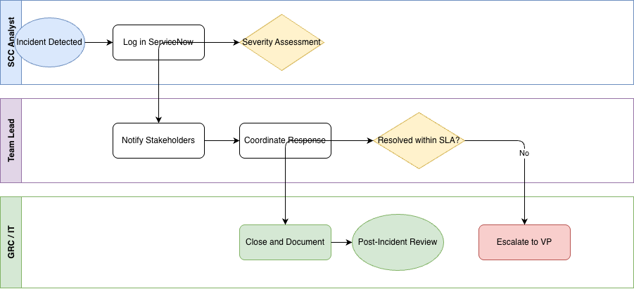
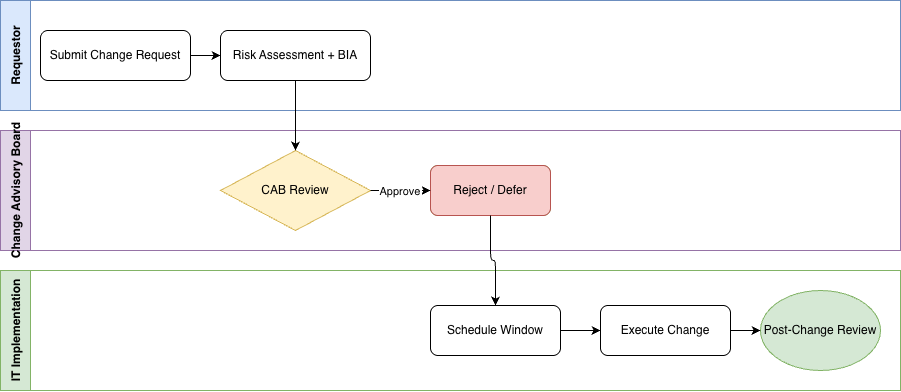

# BPMN Process Diagrams

**Tools:** draw.io · BPMN 2.0
**Context:** Financial & Regulated Operations
**Role:** Security Control Center Analyst — State Street (via Securitas)

---

## Overview

These diagrams document real operational workflows in a regulated financial environment using BPMN 2.0 notation. Both processes reflect work I actively support in my current role — meaning the flows represent actual escalation paths, decision gates, and stakeholder lanes, not hypothetical exercises.

The goal is to demonstrate process modeling fluency relevant to Business Analyst and GRC roles: translating operational knowledge into structured, readable diagrams that bridge the gap between business teams and technical implementation.

---

## Diagram 1 — Incident Escalation & Response Flow

Documents the end-to-end incident response process from detection through resolution or escalation across three swim lanes.

| Lane | Responsibilities |
|------|-----------------|
| SCC Analyst | Incident detection, ServiceNow logging, severity assessment |
| Team Lead | Stakeholder notification, response coordination, SLA gateway |
| GRC / IT | Close & document (SLA met) or escalate to VP (SLA breached) |

**Key decision point:** Resolved within SLA? — Yes path leads to documentation and post-incident review. No path triggers VP escalation.

---

## Diagram 2 — IT Change Management Approval Process

Documents the change request lifecycle from submission through post-implementation review — the process that governs all technology changes in a regulated financial environment.

| Lane | Responsibilities |
|------|-----------------|
| Requestor | Submit change request, risk assessment + business impact analysis |
| Change Advisory Board | CAB review gateway — Approve, Reject, or Defer |
| IT Implementation | Schedule window, execute change, post-change review |

**Key decision point:** CAB Review — Approved changes proceed to implementation. Rejected or deferred changes are returned to the requestor.

---

## BPMN Notation Used

| Symbol | Meaning |
|--------|---------|
| Thin circle | Start event |
| Thick circle | End event |
| Rounded rectangle | Task (unit of work) |
| Diamond (X) | XOR Gateway — exclusive decision point |
| Horizontal bands | Swim lanes — participants / teams |
| Solid arrow | Sequence flow |

---

## Why These Processes

Both diagrams reflect core governance frameworks in financial services.

**Incident response** maps directly to operational resilience requirements — financial institutions must demonstrate structured escalation paths, SLA accountability, and audit-ready documentation for service disruptions.

**IT change management** underpins every technology change in a regulated environment. The CAB approval process, rollback planning, and post-implementation review are controls that GRC and IT BA teams document, monitor, and report on.

Modeling these in BPMN 2.0 is the standard way a Business Analyst or GRC Analyst communicates process requirements to both technical and non-technical stakeholders.

---

## About

Built as part of a skills development sprint targeting GRC Business Analyst roles.

**Author:** Yusuf Masood
**LinkedIn:** [linkedin.com/in/yusufmasood](https://linkedin.com/in/yusufmasood)
**SQL Portfolio Project:** [ops-incident-analysis](https://github.com/thecode2023/ops-incident-analysis)
